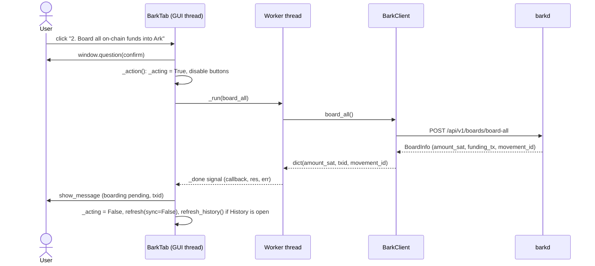
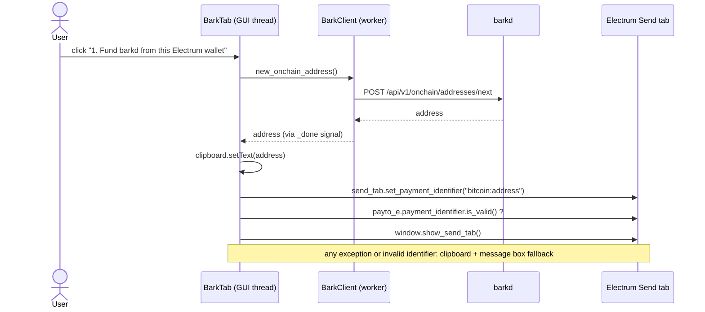

# electrum-bark-plugin: technical documentation

> An [Electrum](https://electrum.org) (Qt) plugin integrating **Bark** (Second's implementation of the **Ark**
> protocol) through the local **`barkd`** REST daemon. Target network: **signet**. Version **0.1.0**.

**Revision:** 2026-10-02. This document describes the tree at `0.1.0` (git `HEAD` `d11ff21` at the time of
writing). Where earlier revisions of the docs described behaviour that is not in the code, the code wins and
the gap is listed in [§15](#15-known-limitations).

**Verification tags.** Every non-trivial claim carries the strength of its evidence:

| Tag | Meaning |
|---|---|
| `[run]` | Executed during the verification pass. Environment: Ubuntu 24.04, CPython 3.12.3, Electrum 4.8.2 (`master` @ `4cb03ef`), `barkd_client` 0.7.2, pydantic 2.13, pytest 9.1.1, PyQt6 (`QT_QPA_PLATFORM=offscreen`). |
| `[src]` | Checked by reading Electrum's or `barkd_client`'s source / OpenAPI docstrings; not exercised end to end. |
| `[author]` | Reported by the author; not reproducible without a live barkd (the `barkd` binary was not available). |
| `[unverified]` | Never executed against the real counterpart. |

## Table of contents

1. [Scope and status](#1-scope-and-status)
2. [Background: Ark, Bark, barkd](#2-background-ark-bark-barkd)
3. [Architecture](#3-architecture)
4. [Requirements](#4-requirements)
5. [Setup](#5-setup)
6. [Configuration reference](#6-configuration-reference)
7. [Using the plugin](#7-using-the-plugin)
8. [Fake client](#8-fake-client)
9. [Source reference](#9-source-reference)
10. [barkd API mapping](#10-barkd-api-mapping)
11. [Demo app and bridge](#11-demo-app-and-bridge)
12. [Testing](#12-testing)
13. [Packaging and distribution](#13-packaging-and-distribution)
14. [Security model](#14-security-model)
15. [Known limitations](#15-known-limitations)
16. [Troubleshooting](#16-troubleshooting)
17. [Extending the plugin](#17-extending-the-plugin)
18. [References](#18-references)
19. [Changelog](#19-changelog)

---

## 1. Scope and status

Electrum is a self-custodial on-chain wallet. Ark is a Bitcoin layer-2 protocol for cheap, fast payments;
Bark is Second's implementation; `barkd` is Bark's wallet daemon, which holds the Ark wallet and exposes it
over REST. The plugin is a thin, non-custodial **GUI client of barkd** inside Electrum.

**In scope**

* Overview of Ark and barkd on-chain balances, connection state.
* Electrum → barkd funding bridge (barkd on-chain address pre-filled in Electrum's Send tab).
* Boarding (all / fixed amount), BIP 321 receive requests, Ark / Lightning / on-chain sends, history.
* Creating the barkd wallet on signet.
* A drop-in in-memory fake client for development and demos.

**Out of scope (not implemented)**

* Key custody inside Electrum, mainnet support, prebuilt-binary distribution.
* VTXO refresh / expiry management, emergency exits, offboard-all, Lightning-specific endpoints,
  notifications/websocket, fee estimation (all exist in `barkd_client`; see [§10](#10-barkd-api-mapping)).

**Maturity.** Hackathon code. The automated suite is green (74 tests) but exercises the plugin only against a
mock barkd and a stub Electrum window; see [§12](#12-testing) and [§15](#15-known-limitations).

## 2. Background: Ark, Bark, barkd

Terms used throughout (the authoritative glossary is in Second's docs):

| Term | Meaning |
|---|---|
| **VTXO** | Virtual UTXO: the off-chain coin an Ark balance is made of. VTXOs expire and must be refreshed. |
| **Board** | Move on-chain bitcoin into Ark. The funding transaction must reach the number of confirmations **required by the Ark server** before the resulting VTXO is spendable off-chain `[src]`. |
| **Round / refresh** | Server-coordinated rounds that renew VTXOs with a fresh expiry. |
| **Arkoor** | Instant out-of-round Ark payment `[src]`; per the author, the server is trusted briefly until the VTXOs are refreshed `[author]`. |
| **Offboard** | Move Ark funds on-chain with the server's cooperation. |
| **Emergency exit** | Unilateral on-chain exit without the server; costlier; what keeps Ark self-custodial. |
| **barkd** | The wallet daemon: owns keys and wallet DB, runs background sync, serves REST on `/api/v1`. |
| **Ark server (ASP)** | Counterparty operator. On signet: `https://ark.signet.2nd.dev` (Esplora: `https://esplora.signet.2nd.dev`). |

barkd runs its own background loops. Per the API docs `[src]`: Lightning state syncs every second, mailbox and
boards every 30 s, and the Ark-server connection flag is refreshed every second. Consequently
`GET /wallet/balance` is computed from **local state** and is "reasonably fresh" without any explicit sync.

## 3. Architecture

### 3.1 Layers and dependency rule

```
┌──────────────────────── Electrum process (Python, Qt) ────────────────────────┐
│ bark/qt.py          Plugin(BarkPlugin): @hook load_wallet / close_wallet,     │
│                     on_close, settings dialog; owns window → BarkTab map      │
│ bark/ui.py          BarkTab(QWidget): Overview | Receive | Send | History     │
│ bark/bark.py        BarkPlugin(BasePlugin): config keys, client() factory     │
│ bark/client.py      BarkClient + error types; ONLY importer of barkd_client   │
│ bark/fake_client.py FakeBarkClient: same interface, in-memory state machine   │
└──────────────┬────────────────────────────────────────────────────────────────┘
               │ HTTP, "Authorization: Bearer <token>", default http://localhost:3001
               ▼
        barkd (owns keys / VTXOs / DB) ──► Ark server        https://ark.signet.2nd.dev
                                       └─► Esplora (chain)   https://esplora.signet.2nd.dev
```

Import graph (arrows = "imports"; there are no cycles) `[run]` (checked by grep):

```
Electrum ─loads─► qt.py ──► bark.py ──► client.py ──► barkd_client ──► barkd
                   │            └─────► fake_client.py ──► client.py   (error types only)
                   └──► ui.py ──► client.py (error types), fake_client.py (FAUCET_SAT, isinstance check)
script/bridge.py ──► client.py, fake_client.py          (no Electrum, no Qt)
```

Invariants and where they are enforced:

| # | Invariant | Enforcement | Test |
|---|---|---|---|
| 1 | The GUI thread never performs I/O | `BarkTab._run` spawns a worker per call; results return via a Qt signal | `test_ui_headless` drives the tab with a `pump()` event loop |
| 2 | One module talks to barkd; everything above sees plain `dict`/`list`/`str` | only `client.py` imports `barkd_client` (plus legacy `script/smoke_test2.py`) | `FakeBarkClient` is a drop-in |
| 3 | Polling is read-only | `snapshot()` never calls address/BIP 321 endpoints (barkd allocates a **new** address per call) | `test_polling_never_creates_addresses` |
| 4 | Typed failures | `_call()` maps library exceptions to `BarkUnavailable` / `BarkNoWallet` / `BarkError` | `test_client.py` error tests |
| 5 | Keys never enter Electrum | the plugin stores only a bearer token | by construction |
| 6 | Mutating UI actions follow one template | `BarkTab._action`: guard → disable buttons → worker → `on_ok`/error → refresh | `test_buttons_disabled_while_acting`, per-action tests |

### 3.2 Plugin lifecycle in Electrum

`[run]` (executed with Electrum's real `Plugins('qt')` manager over the symlinked plugin):

1. Electrum scans `electrum/plugins/*`; `bark/manifest.json` is read, `fullname` is mandatory, and `available_for`
   must contain `"qt"`. Metadata resolves to *Bark (Ark)*.
2. `plugins.enable('bark')` imports `electrum.plugins.bark` (`__init__.py`, comments only), then
   `electrum.plugins.bark.qt`, and instantiates `Plugin(plugins, config, 'bark')`.
3. Methods decorated with `@hook` register in Electrum's hook table: `load_wallet`, `close_wallet`.
4. `ElectrumWindow.load_wallet` fires `run_hook('load_wallet', wallet, window)` `[src]` → the plugin builds a
   `BarkTab`, adds it as the "Bark" tab and triggers a first refresh.
5. `close_wallet` (`run_hook('close_wallet', wallet)`) or plugin disable (`on_close`) → `_remove_tab`:
   `tab.stop()`, remove from `window.tabs`, `deleteLater()`.

`run_hook` only calls hooks of enabled plugins and **catches and logs** exceptions (`Plugin error. plugin: …`)
`[src]`: a faulty hook never crashes Electrum, it silently leaves the tab missing; read the log (`-v`).

Electrum fires `load_wallet` only from `ElectrumWindow.load_wallet` and from the RPC command `load_wallet`
(with `window=None`) `[src]`. Enabling the plugin while a wallet window is open therefore does **not** create
the tab ([§15](#15-known-limitations), L3).

### 3.3 Threading and concurrency model

* `BarkTab._run(fn, callback)` starts a `threading.Thread(daemon=True)` per call. The worker runs `fn()`,
  then emits `_done = pyqtSignal(object, object, object)` with `(callback, result, error)`. Because the emitter
  is a non-Qt thread and the receiver (`_dispatch`) lives in the GUI thread, Qt delivers it queued, so
  `callback(res, err)` always runs on the GUI thread. `_dispatch` drops results once `_closed` is set;
  `RuntimeError` from emitting on a destroyed widget is swallowed.
* Two flags gate re-entrancy, both touched only on the GUI thread:
  * `_polling`: a read-only balance refresh is in flight. `refresh()` returns early if set.
  * `_acting`: a mutating action or a Sync is in flight. It disables every button registered through
    `_action_button` and makes `refresh()` return early, so polling pauses during actions.
* `refresh_history()` has no flag: concurrent history loads are possible and the last response to arrive wins.
* `BarkClient` is stateless: every call builds a fresh `barkd_client.ApiClient` in a `with` block (new
  connection pool, no keep-alive reuse), hence safe across worker threads. `BarkPlugin.client()` returns a new
  `BarkClient` per call, or the **singleton** `FakeBarkClient` held in `plugin._fake`, which serialises state
  with an `RLock`.

Poll cycle (timer `REFRESH_MS = 15_000`, one per open tab): `snapshot(sync=False)` = three sequential GETs
(`wallet/balance`, `onchain/balance`, `wallet/connected`), no writes.

### 3.4 Client contract

`BarkClient` and `FakeBarkClient` expose the same methods and return plain values. `host`/`token` default to
`$BARKD_HOST` (else `http://localhost:3001`) and `$BARKD_TOKEN` when the constructor argument is falsy.

| Method | Returns | Notes |
|---|---|---|
| `snapshot(sync=False)` | `{connected: bool, ark_spendable_sat, ark_pending_board_sat, onchain_confirmed_sat, onchain_spendable_sat, onchain_pending_sat: int}` | `onchain_spendable_sat` = `trusted_spendable_sat`; `onchain_pending_sat` = `trusted_pending + untrusted_pending`. With `sync=True`: balance → `onchain_sync` → balance → onchain balance → connected. |
| `sync()` | `None` | `POST /onchain/sync` only (not the Ark-side `wallet/sync`; see L5). |
| `history()` | `list[{id, time, type, status, amount_sat, fee_sat, counterparty}]`, newest first | `time` = epoch seconds (`int`); `type` = `subsystem.kind or subsystem.name`; `amount_sat` = `effective_balance_sat` (**signed**, negative = outgoing); `fee_sat` = `offchain_fee_sat`; `counterparty` = first of `sent_to`, else first of `received_on`, else `''`. Sorted by `(time, id)` descending. |
| `pending_boards()` | `list[{amount_sat, txid, movement_id}]` | implemented, not used by the UI. |
| `new_onchain_address()` | `str` | **allocates** the next HD address on every call. |
| `receive_uri(amount_sat=None, label=None, message=None, onchain=True)` | `{bip321, ark, bolt11, onchain}` | `ark` always present; `bolt11` only if an amount is given `[src]`; optional fields may be `None`. |
| `create_wallet()` | `None` | hardcodes signet: Ark server, Esplora chain source, `BarkNetwork.SIGNET`. |
| `board_all()` / `board_amount(amount_sat)` | `{amount_sat, txid, movement_id}` | `txid` is the funding transaction. |
| `send(destination, amount_sat=None, comment=None)` | `{message, payment_hash}` | Ark address, BOLT11, BOLT12 offer, Lightning address. |
| `send_onchain(destination, amount_sat)` | `{txid}` | `txid` = `offboard_txid`. |

Client-side validation runs **before any request** (`_check_amount`, `_check_text`): amounts must be `int > 0`
(`bool`, `float`, `str`, `0`, negatives are rejected with `BarkError`), required amounts and destinations must be
present, destinations and labels are stripped. Covered by `test_invalid_amounts_are_rejected_before_any_request`.

Timeouts (`_request_timeout`, a single number = total timeout of that HTTP request):

| Constant | Value | Applies to |
|---|---|---|
| `READ_TIMEOUT` | 15 s | balances, connected, history, pending boards, new address |
| `ACTION_TIMEOUT` | 60 s | board, send, send-onchain, bip321 (may involve an Ark round) |
| `SYNC_TIMEOUT` | 90 s | `onchain/sync`, `wallet/create` |

Worst case for `snapshot(sync=True)` is 15 + 90 + 15 + 15 + 15 = **150 s** of sequential requests.

### 3.5 Error model

`client._call(fn)` is the single translation point:

| Raised by library | Becomes | Condition |
|---|---|---|
| `ApiException` | `BarkNoWallet` | `"No wallet set"` in the response body (any status; barkd answers `422`) |
| `ApiException` | `BarkError("Unauthorized: wrong or missing barkd token")` | `status == 401` |
| `ApiException` | `BarkError("barkd error <status>: <detail>")` | otherwise; `<detail>` = JSON `message` / `error` / `detail`, else the raw body |
| `urllib3.HTTPError`, `OSError` | `BarkUnavailable(str(e))` | connection refused, DNS, timeouts (only *connection refused* is tested) |
| `OpenApiException`, `pydantic.ValidationError` | `BarkError("Unexpected response from barkd: …")` | response shape differs from the generated models (typical symptom of client/daemon version skew) |

`BarkNoWallet` and `BarkUnavailable` subclass `BarkError`. A missing token raises `BarkError` from `_api()`
**before** any request. UI mapping (`BarkTab._show_error`): `BarkNoWallet` → "no wallet" status + *Create barkd
wallet* button; `BarkUnavailable` → status line + error dialog; anything else → error dialog with the message.

### 3.6 Runtime flows

**Board all** (the common action template):



**Fund barkd from Electrum** (the only place the plugin touches Electrum internals):



Electrum's `set_payment_identifier` swallows `InvalidPaymentIdentifier` (it shows its own error), so the
plugin re-checks `is_valid()` explicitly. Existence of `send_tab.set_payment_identifier`,
`send_tab.payto_e.payment_identifier`, `PaymentIdentifier.is_valid` and `window.show_send_tab` was verified in
Electrum 4.8.2 `[src]`; the live effect is `[unverified]` (tests use a stub).

**Settings change.** `settings_dialog` → `BarkPlugin.save_settings(host, token, use_fake)` writes the three
config keys, calls `reset_fake()` (discards fake state), then every open tab runs `refresh(sync=False)`.

## 4. Requirements

| Component | Version | Evidence |
|---|---|---|
| OS | Linux (commands below use Debian/Ubuntu package names) | `[run]` Ubuntu 24.04 |
| Python | 3.10+ | `[run]` full suite on 3.12.3; `[author]` 3.10 (the tree contained 3.10 bytecode) |
| Electrum (source) | 4.8.2 | `[run]` import + full GUI test suite + plugin load. The plugin API moves between releases: pin your checkout. |
| `barkd_client` | **0.7.2** (`requirements.txt`) | `[run]` |
| barkd | 0.7.1 | `[author]`; note the minor-version skew with the client (see below) |
| PyQt6 | any recent | `[run]` |
| pytest | any recent (tests only; **not** in `requirements.txt`) | `[run]` 9.1.1 |

**Client/daemon skew.** `barkd_client` is generated from barkd's OpenAPI spec; models are strict (pydantic).
If the daemon's schema drifts from the client's (here client 0.7.2 vs daemon 0.7.1), missing or renamed fields
surface as `BarkError("Unexpected response from barkd: …")`. The mock-based tests encode 0.7.2 shapes only.
Pin the client to the daemon's minor version when possible.

System packages (Debian/Ubuntu) `[run]`:

```bash
sudo apt update
sudo apt install -y git python3-venv python3-pip build-essential autoconf automake libtool pkg-config libxcb-cursor0
```

`autoconf automake libtool` are needed because `electrum_ecc` compiles libsecp256k1 (without them
`pip install` fails with *Failed building wheel for electrum_ecc*); `libxcb-cursor0` is required by Qt6 on recent
Ubuntu.

## 5. Setup

Defaults assume this layout (`run_tests.sh` expects Electrum at `../electrum`, `_barkd_bin.sh` looks for the
binary at `../barkd/barkd`); override with `ELECTRUM_DIR` / `BARKD_BIN`:

```
~/hackathon/
├── electrum/                 # Electrum source checkout (unmodified)
├── electrum-bark-plugin/     # this repository
├── barkd/                    # optional: barkd binary
└── venv/                     # one virtualenv for Electrum + plugin
```

### 5.1 Python environment and Electrum

```bash
mkdir -p ~/hackathon && cd ~/hackathon
python3 -m venv venv && source venv/bin/activate
git clone https://github.com/spesmilo/electrum.git
cd electrum && git describe --tags          # record your version
pip install --upgrade pip
pip install -r contrib/requirements/requirements.txt PyQt6 cryptography
./run_electrum --signet                     # sanity check: the window opens; close it
cd ..
```

`[run]` The dependency installation and `import electrum` were executed (on a system interpreter rather than a
venv, with the system packages from §4); the Electrum window itself was not opened.

### 5.2 This repository

```bash
cd ~/hackathon
git clone https://github.com/pietrovalese/electrum-bark-plugin.git
cd electrum-bark-plugin
pip install -r requirements.txt pytest       # barkd_client==0.7.2 (+ pytest)
```

### 5.3 barkd

Install the binary following *Install Barkd* in Second's documentation (https://second.tech/docs). Binary
lookup order in `script/_barkd_bin.sh`: `$BARKD_BIN` → `barkd` on `$PATH` → `../barkd/barkd`; otherwise the
scripts exit with `barkd not found`.

### 5.4 Link the plugin into Electrum `[run]`

```bash
./script/dev_link.sh ../electrum
```

Creates the symlink `electrum/electrum/plugins/bark → <repo>/bark` and appends `electrum/plugins/bark` to the
Electrum clone's `.git/info/exclude`. The script is idempotent (re-running prints `already linked`) and refuses
to touch a non-symlink path or a symlink pointing elsewhere. Edits apply at the next Electrum start.

### 5.5 Run barkd

```bash
./script/run_barkd.sh        # exec barkd --datadir "$BARKD_DATADIR" --port "$BARKD_PORT"
```

Defaults: datadir `~/.bark-signet`, port **3001** (barkd's own default 3000 is frequently occupied). Expected
first-start log `[author]`: `Server starting on http://127.0.0.1:3001`, `No auth token found — generated a new
one`, `No wallet found. Starting rest server without daemon`; all normal. On `Address already in use`, free the
port (`sudo ss -ltnp | grep :3000`) or pick another with `BARKD_PORT` and set the same URL in the plugin.

### 5.6 Authentication token

Every request needs `Authorization: Bearer <token>`.

```bash
export BARKD_TOKEN="$(./script/barkd_token.sh)"     # runs: barkd --datadir "$BARKD_DATADIR" secret show
```

* Use the **same** `BARKD_DATADIR` that barkd was started with.
* Rotation `[author]`: stop barkd, run `barkd --datadir ~/.bark-signet secret refresh`, restart.
* barkd refuses `--no-auth` on non-local hosts `[author]`. Keep it on `127.0.0.1`.

### 5.7 Smoke test (no Electrum)

```bash
python script/smoke_test.py       # needs BARKD_TOKEN; honours BARKD_HOST
```

Prints the barkd URL, creates the wallet on signet if `BarkNoWallet` is raised, prints a `snapshot(sync=True)`
as JSON and a fresh on-chain address, and exits `1` on `BarkUnavailable`/`BarkError`. If it succeeds, barkd and
the client are fine and any remaining problem is in Electrum or the plugin.

### 5.8 Getting signet coins

Boarding needs **confirmed** coins in barkd's *on-chain* wallet.

1. Get a barkd on-chain address: `python script/smoke_test.py`, or *Fund barkd…* in the plugin
   (`tb1p…` taproot, **not** the `tark1…` Ark address).
2. Fund it from the faucet in Second's *Test on signet* guide (https://second.tech/docs/getting-started/bark-cli/signet),
   or from an Electrum signet wallet via the bridge ([§7](#7-using-the-plugin)).
3. Wait for confirmation; `onchain_confirmed_sat` must be `> 0`.

> **Caveat `[unverified]`.** Second's infrastructure lives under `2nd.dev`. If their signet is not the public
> signet, generic faucets and Electrum's default signet servers will not see the same chain. Verify a funding
> transaction on `https://esplora.signet.2nd.dev`, and fall back to the [fake client](#8-fake-client) if needed.

### 5.9 Run Electrum with the plugin

```bash
export BARKD_TOKEN="$(~/hackathon/electrum-bark-plugin/script/barkd_token.sh)"   # optional, see §6
cd ~/hackathon/electrum && ./run_electrum --signet -v
```

1. Create or open a **signet** wallet (throwaway).
2. **Tools → Plugins → Bark (Ark)** → Enable. The tab is added by the `load_wallet` hook; if a wallet window
   was already open, **close and reopen the wallet** (L3).
3. Open **Settings** (button in the plugin list, or inside the Bark tab) and set URL / token / fake flag.
4. The status line reads *Connected to the Ark server*, or *barkd is running but has no wallet yet* with a
   **Create barkd wallet (signet)** button.

## 6. Configuration reference

**Electrum config keys** (plain `config.get` / `config.set_key`, not registered `ConfigVar`s; Electrum
documents `ConfigVar`s as preferred `[src]`). Stored in `<electrum_datadir>/signet/config` (JSON, mode `0600`
on creation) `[run]`; default datadir on Linux is `~/.electrum`.

| Key | Type | Default | Notes |
|---|---|---|---|
| `bark_host` | `str` | unset → `http://localhost:3001` | The settings dialog pre-fills the effective value, so saving persists it explicitly. |
| `bark_token` | `str` | unset → env | **Stored in clear text.** An empty string is falsy and falls through to `$BARKD_TOKEN`. |
| `bark_use_fake` | `bool` | `false` | Switches `BarkPlugin.client()` to the `FakeBarkClient` singleton. |
| `plugins.bark.enabled` | `bool` | Electrum-managed | Written by Electrum's enable/disable. |

`set_key` is refused by Electrum for keys given on the command line (`is_modifiable`) `[src]`.

**Resolution order** `[run]`:

| Value | Plugin (`bark.py` → `BarkClient`) | CLI scripts (`smoke_test.py`, `bridge.py`) |
|---|---|---|
| Host | `bark_host` → `DEFAULT_HOST`. **`BARKD_HOST` is never consulted** (L4) | `$BARKD_HOST` → `DEFAULT_HOST` |
| Token | `bark_token` (if non-empty) → `$BARKD_TOKEN` → `BarkError("barkd token missing: …")` | `$BARKD_TOKEN` |

`BARKD_TOKEN` is read from the **environment of the process that launched Electrum**; exporting it afterwards
has no effect.

**Script environment variables**

| Variable | Default | Used by |
|---|---|---|
| `BARKD_BIN` | `barkd` on `$PATH`, else `../barkd/barkd` | `run_barkd.sh`, `barkd_token.sh` |
| `BARKD_DATADIR` | `~/.bark-signet` | same |
| `BARKD_PORT` | `3001` | `run_barkd.sh` |
| `ELECTRUM_DIR` | `<repo>/../electrum` | `run_tests.sh` |

## 7. Using the plugin

Funds move through these states:

```
Electrum wallet ──(on-chain tx to barkd's address)──► barkd on-chain (confirmed)
   ──(board)──► Ark, boarding (pending) ──(server-required confirmations)──► Ark balance (spendable)
   ──(send / send-onchain)──► Ark / Lightning / on-chain destination
```

**Overview** labels and their sources:

| UI label | `snapshot` key | Source field |
|---|---|---|
| Ark balance (spendable) | `ark_spendable_sat` | `WalletApi.balance.spendable_sat` |
| Ark, boarding (pending) | `ark_pending_board_sat` | `WalletApi.balance.pending_board_sat` |
| barkd on-chain (confirmed) | `onchain_confirmed_sat` | `OnchainApi.onchain_balance.confirmed_sat` |
| `(+N unconfirmed)` suffix | `onchain_pending_sat` | `trusted_pending_sat + untrusted_pending_sat` |
| status line | `connected` | `WalletApi.connected.connected` |

`onchain_spendable_sat` is returned but not displayed. Other `balance` fields (`pending_in_round_sat`,
`pending_lightning_send_sat`, `claimable_lightning_receive_sat`, pending exit) are dropped by `snapshot()` (L10).

1. **Create the wallet** (only if barkd has none): *Create barkd wallet (signet)* → `POST /wallet/create`.
2. **Fund barkd from Electrum**: *1. Fund barkd from this Electrum wallet…* (see the flow in
   [§3.6](#36-runtime-flows)). Enter an amount in Electrum's Send tab, pay normally, wait for confirmation.
3. **Board**: when *barkd on-chain (confirmed)* shows the funds, *2. Board all on-chain funds into Ark* (modal
   confirmation) or *Board a specific amount…* (`QInputDialog.getInt`, capped at `MAX_BOARD_INPUT_SAT =
   2_147_483_647`, then a confirmation). The board's VTXO stays under *Ark, boarding (pending)* until the funding
   transaction reaches the confirmation depth required by the Ark server, then moves to *Ark balance*.
4. **Receive**: optional amount (sat) / label / message and *Include an on-chain fallback address* → *Generate
   payment request* → one BIP 321 URI with QR, plus separate read-only fields (URI, Ark address, Lightning
   invoice, on-chain address) with *Copy*. Per the API docs `[src]`: the Ark address is always included; a BOLT11
   invoice is generated **only when an amount is given**; on test networks the on-chain fallback is carried as a
   `tb=` parameter rather than in the URI body. The UI notes when no invoice was returned and when the URI
   overflows a QR code (`QrCodeDataOverflow`).
5. **Send**: the radio button selects the endpoint; there is **no client-side address-type detection**.
   *Ark / Lightning* → `POST /wallet/send` (Ark address, BOLT11, BOLT12 offer, Lightning address; amount
   optional only when the invoice/offer already encodes one, required for Ark and Lightning addresses
   `[src]`). *On-chain* → `POST /wallet/send-onchain`: pays an on-chain address **from the Ark balance** via an
   out-of-round consolidation and a cooperative on-chain payment through the Ark server, with the on-chain fee
   charged **on top of** the amount `[src]` (the confirmation dialog does not show that fee). A confirmation
   lists destination, amount and type. The `comment` argument of `send()` exists but is not exposed in the UI.
6. **History**: columns *Date, Type, Status, Amount, Fee, Counterparty*; loaded when the History page opens
   (`PAGE_HISTORY = 3`), after any action while it is open, and after Sync.

*Sync* → `snapshot(sync=True)`: calls `POST /onchain/sync` (on-chain wallet only) and re-reads balances. The tab
also polls every 15 s without syncing.

## 8. Fake client

*Settings → Use fake client* swaps in `FakeBarkClient('no_wallet')`: a deterministic in-memory simulation with the
same interface. `BarkPlugin.client()` returns the **same object** on every call (state persists across clicks) and
`save_settings()` discards it.

| Aspect | Behaviour |
|---|---|
| Scenarios | `'no_wallet'` (default; every wallet method raises `BarkNoWallet`), `'ok'`, `'down'` (`BarkUnavailable`). `create_wallet()` switches to `'ok'`. |
| Faucet | `faucet(amount=FAUCET_SAT = 100_000)` adds confirmed on-chain funds. **Fake-only**: the *Fake client: simulate faucet* button shows iff `isinstance(client, FakeBarkClient)`; the bridge exposes `faucet` only with `--fake`. |
| Boarding | `_board` moves funds on-chain → `pending_board` and records a `pending` movement. Each `snapshot()` or `sync()` calls `_tick()`; after `BOARD_CONFIRM_REFRESHES = 2` ticks the board becomes spendable and the movement `successful`. |
| Fees | Lightning sends: `max(1, amount * LN_FEE_PPM // 1_000_000)` with `LN_FEE_PPM = 1000` (0.1 %). On-chain sends: fixed `ONCHAIN_FEE_SAT = 200`, added on top. Ark sends: 0. |
| Destination rules | Lightning if it starts with `ln` / `lightning:` or contains `@`; Ark if it starts with `tark1` / `ark1`; anything else → `BarkError("Unrecognized destination")`. On-chain: rejects `ln…`/`tark1`/`ark1` prefixes and strings shorter than 14 chars. |
| Implicit amounts | A destination starting `lnbc` / `lntb` / `lno1` with no amount "contains" `FAKE_INVOICE_SAT = 1_000`; otherwise `BarkError("Missing amount.")`. |
| Addresses | `fake_onchain_address(n)`: valid **bech32 v0** `tb1q…` (self-contained encoder), accepted by Electrum's Send tab. Real barkd returns taproot `tb1p…`. Ark address: `tark1qfake…`. |
| `receive_uri` | BOLT11 only if an amount is given (mirrors the documented barkd behaviour); URI `bitcoin:<onchain>?ark=…&lightning=…&amount=…`. |
| Concurrency | `RLock` around state; `time.sleep` simulates latency (0.1 to 0.5 s) and is monkeypatched out in tests. |
| Validation parity | `_check_amount` is duplicated from `client.py` and must be kept in sync (L12). |

Use it to develop the GUI, rehearse demos, and as a fallback when the faucet or network fails. Untick the option
to return to the real barkd.

Representativeness caveat: the fake's BIP 321 string places the on-chain address in the URI body, whereas the
API docs say test networks use a `tb=` parameter `[src]`. Do not use fake URIs to validate URI parsing.

## 9. Source reference

### 9.1 Plugin (`bark/`)

| File | Responsibility | Key symbols |
|---|---|---|
| `manifest.json` | Metadata Electrum reads **before** importing any code. Current values: `name: "bark"`, `fullname: "Bark (Ark)"`, `available_for: ["qt"]`, `version: "0.1.0"`, `license: "MIT"`, `author: "Pietro"`, plus a `description` (Italian). | Electrum requires `fullname`; `available_for` must contain the GUI name; optional `min_electrum_version` / `max_electrum_version` are enforced **only for zip plugins** `[src]`. |
| `__init__.py` | Package marker with comments only (no config vars, no commands). | – |
| `qt.py` | Electrum entry point (`electrum.plugins.bark.qt.Plugin`). | `Plugin.load_wallet(wallet, window)`, `close_wallet(wallet)`, `on_close()`, `_remove_tab`, `requires_settings`, `settings_widget`, `settings_dialog`; `self.tabs: dict[window, BarkTab]` |
| `bark.py` | GUI-independent core (still imports `electrum.plugin.BasePlugin`). | `BarkPlugin.get_host/get_token/use_fake/save_settings/reset_fake/client` |
| `ui.py` | The Bark tab. | `BarkTab`; `REFRESH_MS`, `MAX_BOARD_INPUT_SAT`, `PAGE_HISTORY`; helpers `fmt_sat(n, signed=False)` (`None` → `'-'`), `parse_sat(text, name)` (accepts `,` `_` and spaces as separators; `None` if empty; `ValueError` if not a positive integer) |
| `client.py` | The barkd client and error types. | `BarkClient`, `BarkError`, `BarkUnavailable`, `BarkNoWallet`, `_call`, `_detail`, `_check_amount`, `_check_text`, `_movement_to_dict`; constants `DEFAULT_HOST`, `SIGNET_ARK_SERVER`, `SIGNET_ESPLORA`, `READ_TIMEOUT`, `ACTION_TIMEOUT`, `SYNC_TIMEOUT` |
| `fake_client.py` | In-memory twin of `BarkClient`. | `FakeBarkClient`, `FAUCET_SAT`, `BOARD_CONFIRM_REFRESHES`, `LN_FEE_PPM`, `ONCHAIN_FEE_SAT`, `FAKE_INVOICE_SAT`, `segwit_v0_address`, `fake_onchain_address` |

`BarkTab` methods by role: builders `_build_header/_overview/_receive/_send/_history`; plumbing `_run`,
`_dispatch`, `_set_acting`, `_action`, `_show_error`; refresh `refresh`, `refresh_history`, `_on_snapshot`,
`_on_history`, `_show_no_wallet`, `_show_unavailable`, `_clear`; actions `do_sync`, `create_wallet`,
`fake_faucet`, `fund_barkd`/`_prefill_electrum_send`, `board_all`, `board_amount`/`_board_done`,
`generate_request`/`_show_request`, `send_payment`/`_send_done`; lifecycle `stop`.

### 9.2 Scripts (`script/`)

| File | Purpose |
|---|---|
| `_barkd_bin.sh` | Sourced by the other shell scripts: resolves `$BARKD`, `$DATADIR`, `$PORT`. |
| `run_barkd.sh` | `exec barkd --datadir "$DATADIR" --port "$PORT"`; creates the datadir. |
| `barkd_token.sh` | `exec barkd --datadir "$DATADIR" secret show`. |
| `dev_link.sh` | Symlinks `bark/` into an Electrum checkout and adds it to `.git/info/exclude` (see [§5.4](#54-link-the-plugin-into-electrum-run)). |
| `build_zip.sh` | Builds `dist/bark-<manifest version>.zip` ([§13](#13-packaging-and-distribution)). |
| `run_tests.sh` | `PYTHONPATH="$ROOT:$ELECTRUM_DIR"`, `QT_QPA_PLATFORM=offscreen`, `python -m pytest tests "$@"`. |
| `smoke_test.py` | Client-level health check ([§5.7](#57-smoke-test-no-electrum)). |
| `bridge.py` | Loopback HTTP bridge between the demo page and the client ([§11](#11-demo-app-and-bridge)). |
| `smoke_test2.py`, `test_client.py` | **Legacy, see L13.** Do not use. |

### 9.3 Tests and demo

See [§12](#12-testing) and [§11](#11-demo-app-and-bridge).

## 10. barkd API mapping

REST paths are relative to `/api/v1` and were read from `barkd_client` 0.7.2 `[src]`; HTTP methods are
exercised by the real client against the mock in `test_client.py` `[run]`.

| `BarkClient` method | `barkd_client` call | REST endpoint | Used by |
|---|---|---|---|
| `snapshot()` | `WalletApi.balance` | `GET /wallet/balance` | Overview, poll |
| | `WalletApi.connected` | `GET /wallet/connected` | status line |
| | `OnchainApi.onchain_balance` | `GET /onchain/balance` | Overview |
| `sync()`, `snapshot(sync=True)` | `OnchainApi.onchain_sync` | `POST /onchain/sync` | *Sync* |
| `history()` | `HistoryApi.list` | `GET /history` | History |
| `pending_boards()` | `BoardsApi.get_pending_boards` | `GET /boards/pending` | (unused by UI) |
| `new_onchain_address()` | `OnchainApi.onchain_address` | `POST /onchain/addresses/next` | *Fund barkd…* |
| `receive_uri()` | `WalletApi.bip321_uri` | `POST /wallet/bip321` | Receive |
| `create_wallet()` | `WalletApi.create_wallet` | `POST /wallet/create` | *Create barkd wallet* |
| `board_all()` | `BoardsApi.board_all` | `POST /boards/board-all` | Overview |
| `board_amount()` | `BoardsApi.board_amount` | `POST /boards/board-amount` | Overview |
| `send()` | `WalletApi.send` | `POST /wallet/send` | Send (Ark / Lightning) |
| `send_onchain()` | `WalletApi.send_onchain` | `POST /wallet/send-onchain` | Send (on-chain) |

Semantics that matter for the UI (from the API's own descriptions `[src]`):

* `balance`: local state, kept fresh by the daemon; call `wallet/sync` first for up-to-the-moment figures.
* `onchain/addresses/next`: returns the next unused HD address **each call**; `wallet/bip321` also allocates
  fresh addresses. Hence they are never used by polling.
* `bip321`: Ark address always; BOLT11 iff `amount_sat`; on-chain fallback iff `onchain=true`, as a `tb=`
  parameter on test networks; optional `uppercase` query parameter (unused here) for compact QR encoding.
* `send`: Ark address (arkoor, instant), BOLT11, BOLT12 offer, Lightning address; `amount_sat` required for Ark
  and Lightning addresses; `comment` only for Lightning addresses; on-chain destinations must use `send-onchain`.
* `send-onchain`: from the Ark balance; fee on top; out-of-round consolidation then a cooperative on-chain
  payment via the Ark server. To offboard whole VTXOs use `offboard/vtxos` or `offboard/all` (not wired up).
* `board-all`: drains the on-chain balance into **one** VTXO; spendable only after the server-required
  confirmations.

Available in `barkd_client` 0.7.2 but unused: `WalletApi.sync` (`/wallet/sync`), `refresh_all`,
`offboard_all`, `vtxos`, `ark-info`, `next-round`, `rounds`, `LightningApi` (`generate_invoice`, `pay`,
`get_receive_status`), `NotificationsApi` (`wait_notification`, `websocket_ticket`), `FeesApi`, `ExitsApi`,
`OnchainApi` (`utxos`, `transactions`, `send`, `drain`), `/wallet/mnemonic`. To explore: in the venv,
`import barkd_client`, list names ending in `Api`, then `dir(Api)`, `inspect.getdoc(method)`,
`inspect.signature(method)`; request/response models are pydantic classes (`model_fields`).

## 11. Demo app and bridge

### 11.1 The page

`Ark Quest.html` (page title *B(Ark) Quest: board the Ark from Electrum*) is a single self-contained file
(about 600 dense lines, no build step, no assets): a top-down pixel-art game drawn on a `<canvas>` (logical
320×224, displayed 640×448). Controls: arrows/WASD move, `E` talk, `Space` attack, `Q` journal, `M` sound; XP,
a journal, five badges (*First board, Patient one, Speed demon, Merchant, Guardian*), monster waves and a boss,
and an end screen listing recent movements. Its only external resource is Google Fonts (*Press Start 2P*,
*JetBrains Mono*), requested from `fonts.googleapis.com`.

| Mode | When | Behaviour |
|---|---|---|
| Simulation | opened as a file, or `GET /api/mode` fails | pure client-side state; talks to nothing |
| Live | served by `bridge.py` (`GET /api/mode` → `{"live": true, "fake": <bool>}`) | game actions call `POST /api/<name>`; the footer shows *Live: real plugin calls, fake client* or *Live: connected to barkd* |

Calls the page makes: `snapshot`, `history`, `create_wallet`, `new_onchain_address`, `board_all`, `receive_uri`,
`send`, `send_onchain`, `faucet`. `docs/index.html` is the same page with the live-mode probe replaced by the
static label *Simulation: no wallet or network is used.*, intended for static hosting (the `docs/` location
matches GitHub Pages' folder source; the hosting configuration is not part of the repo). It is a manual copy:
regenerate it when the page changes (L14).

### 11.2 The bridge (`script/bridge.py`)

```bash
python script/bridge.py --fake          # FakeBarkClient('no_wallet'); no barkd needed
python script/bridge.py                 # BarkClient() from BARKD_TOKEN / BARKD_HOST
python script/bridge.py --port 8765     # default port
```

`ThreadingHTTPServer` bound to `127.0.0.1`. Serves `Ark Quest.html` (fallback `demo/ark-quest.html`) at `/` and
`/index.html`; the token stays in the process and never reaches the browser.

| Route | Behaviour |
|---|---|
| `GET /api/mode` | `{"live": true, "fake": <bool>}` |
| `POST /api/<name>` | `name` ∈ `snapshot`, `history` (**first 10 rows only**), `create_wallet`, `new_onchain_address`, `board_all`, `board_amount`, `receive_uri`, `send`, `send_onchain`, `faucet` (`--fake` only, else 400). Body: JSON object with the method's arguments (`amount_sat`, `destination`, `comment`, `label`, `message`, `onchain`). Response `{"result": …}`. |

Error mapping: `BarkNoWallet` → **409** `kind: no_wallet`; `BarkUnavailable` → **503** `kind: unavailable`;
`BarkError` → **400** `kind: error`; anything else → **500**; unknown call → 404.

Guards: the `Host` header must be `127.0.0.1:<port>` or `localhost:<port>` (DNS rebinding); every path under
`/api/` requires `X-Ark-Quest: 1`, and no CORS headers are ever sent (`OPTIONS` is unsupported), so a cross-origin page cannot get past the
preflight that its custom header triggers, nor read responses; responses carry `Cache-Control: no-store`.

Behaviour observed with `--fake` `[run]`:

| Request | Result |
|---|---|
| `GET /` | 200 `text/html; charset=utf-8` |
| `GET /api/mode` without the header | 403 `missing X-Ark-Quest header` |
| `GET /api/mode` with the header | 200 `{"live": true, "fake": true}` |
| `Host: evil.com` | 403 `bad host` |
| unknown call | 404 `unknown call: nope` |
| `snapshot` on a fresh fake | 409 `no_wallet`; then `create_wallet` → `faucet` → `board_all` all 200 |
| malformed JSON body | **500** `JSONDecodeError` |
| JSON array body | **500** `AttributeError` |
| body larger than 64 KiB | **500** `JSONDecodeError` (the read is capped at 65 536 bytes, then parsed truncated) |
| `OPTIONS` | 501 (no preflight support) |
| startup output | one line: `Ark Quest on http://127.0.0.1:8765/ (fake client)  Ctrl+C to stop`; no warning about spending |

The bridge performs **no confirmation step** and has **no automated tests** (L9). In live mode any local process
able to set one header can make barkd spend funds.

## 12. Testing

```bash
cd ~/hackathon/electrum-bark-plugin && source ../venv/bin/activate
./script/run_tests.sh            # all tests
./script/run_tests.sh -k client -x
```

`run_tests.sh` sets `PYTHONPATH="$ROOT:$ELECTRUM_DIR"` and `QT_QPA_PLATFORM=offscreen`. `conftest.py` also
defaults `QT_QPA_PLATFORM` to `offscreen` and puts the repo root and `tests/` on `sys.path`. Tests import the mock
as `mock_barkd`, **not** `tests.mock_barkd`, because Electrum ships its own top-level `tests` package that would
shadow ours.

| Module | Tests | What it proves | What it cannot prove |
|---|---|---|---|
| `test_client.py` | 34 | The **real** `barkd_client` + `BarkClient` against `mock_barkd.py` (stdlib HTTP server, barkd-shaped JSON, records every request): parsing, `(time, id)` ordering, exact request bodies, bearer header on every request, sync-before-balance ordering, no address endpoints during polling, error mapping (no wallet, 401, 4xx/5xx, non-JSON body, wrong shape, refused connection), pre-request validation, env fallbacks | barkd's real behaviour; the mock reproduces response **shapes** from the client library. Its BIP 321 string places the address in the URI body, unlike the documented `tb=` form on test networks. Read-timeout mapping is untested. |
| `test_fake_client.py` | 14 | Fake state machine, errors, history order, address validity and uniqueness | – |
| `test_ui_headless.py` | 26 | The real `BarkTab` with real Electrum Qt widgets (`QRCodeWidget`) offscreen, a stub window (`show_error/show_message/question/show_send_tab`, `FakeSendTab.set_payment_identifier`) and the fake client, across the full journey: no wallet → create → faucet → fund bridge → board → confirm → receive → send (Ark / on-chain) → history → sync → stop | Real `ElectrumWindow`, the settings dialog, and the `is_valid()` rejection branch of the Send-tab bridge (the stub has no `payto_e`) |

`[run]` results: **74 passed** with Electrum and PyQt6 importable; **48 passed, 1 skipped** without them (the whole
GUI module is skipped via `importorskip`). The suite takes about 4 s.

Not covered by any test: `qt.py` (hooks, settings dialog), `bark.py` (config precedence), `script/bridge.py`,
`build_zip.sh`, `dev_link.sh` (the last two were exercised manually `[run]`). There is no CI configuration.

## 13. Packaging and distribution

**Development (directory plugin).** `dev_link.sh` places `bark/` at `electrum/plugins/bark`; Electrum treats it
as an *internal* plugin `[run]`. `min/max_electrum_version` are **not** checked for directory plugins `[src]`.

**Zip plugin.**

```bash
./script/build_zip.sh        # → dist/bark-0.1.0.zip   (version read from bark/manifest.json)
```

`[run]` The zip contains seven files under a top-level `bark/` (`__init__.py`, `bark.py`, `client.py`,
`fake_client.py`, `manifest.json`, `qt.py`, `ui.py`); `__pycache__` and `*.pyc` are skipped. Electrum's
`Plugins.read_manifest` takes the first entry ending in `manifest.json` and records its directory `[src]`;
version bounds are checked in `find_zip_plugins` `[src]`. Install via **Tools → Plugins → Add**; Electrum gates
third-party zips behind an authorization step (`Plugins.is_authorized` `[src]`) and loads them from memory after a
hash check. The GUI install flow itself was not exercised `[unverified]`. Bump `version` in the manifest before
building a release.

**Runtime dependency.** `client.py` imports `barkd_client` at import time, so the interpreter running Electrum
must have `barkd_client==0.7.2`; otherwise loading fails with *Error loading bark plugin: ModuleNotFoundError…*
(visible in `-v` output). This rules out Electrum's AppImage, Windows and macOS binaries, which cannot install
extra packages: distribute as a from-source workflow.

## 14. Security model

**Assets:** the Ark wallet (keys, VTXOs, DB: all inside barkd's datadir) and the barkd **bearer token**, which
authorises every operation including sends, boards and offboards.

| Boundary / threat | Control | Residual risk |
|---|---|---|
| Electrum ↔ barkd | Loopback HTTP + bearer token | No TLS. The settings dialog does **not** warn about non-local or non-HTTPS URLs (L8): a remote `http://` URL sends the token in clear. |
| Token at rest | Env var `BARKD_TOKEN` (preferred) or Electrum config key `bark_token` | Config storage is **clear text** (file mode `0600` `[run]`). Process environments are readable by same-user processes. |
| Accidental spends | Modal confirmations for *Board all*, *Board a specific amount* and every *Send* (destination, amount, type) | No confirmation for *Create wallet*; the on-chain fee of `send-onchain` is not shown (L11). |
| Address exhaustion | Polling is read-only; allocation only on explicit actions | Each *Fund barkd…* / *Generate payment request* consumes an HD index. |
| Browser → bridge | Loopback bind, `Host` allow-list, mandatory custom header, no CORS, 64 KiB cap | No confirmation, no per-process auth: any local process can spend in live mode (L9). Run it only during a signet demo. |
| Wrong network | `create_wallet` hardcodes signet endpoints | Nothing stops the plugin from operating a **mainnet** barkd wallet if one is configured (L16). |
| Secret hygiene | `.gitignore` covers caches only | Add `.env`, `venv/`, `dist/`; never commit tokens, datadirs or mnemonics. If a token reaches git history, rotate it (`secret refresh` `[author]`). |

barkd's mnemonic endpoint exists in the client (`/wallet/mnemonic`) and is disabled by default `[author]`; the
plugin never calls it. Per Second's backup guidance `[author]` the mnemonic alone restores Ark funds only with
the server's cooperation; a full recovery also needs the datadir/database backup. Irrelevant on signet, worth
stating in a demo.

## 15. Known limitations

| ID | Area | Finding | Evidence | Suggested fix |
|---|---|---|---|---|
| L1 | Verification | Board, send and receive have never run against a live barkd with funded signet coins. | – | Follow the live check order below. |
| L2 | Verification | Never run in a real Electrum window: tab insertion, settings dialog, effect of `set_payment_identifier`. | tests use stubs | Manual run with `./run_electrum --signet -v`. |
| L3 | `qt.py` | Enabling the plugin while a wallet window is open does not create the tab; Electrum fires `load_wallet` only on wallet load. | `[src]` hook sites | On `Plugin.__init__`, enumerate open Qt windows and attach tabs. Workaround: reopen the wallet. |
| L4 | `bark.py` | `BARKD_HOST` is ignored by the plugin: `get_host()` returns `DEFAULT_HOST`, so `BarkClient` never reaches its env fallback. | `[run]` | `return self.config.get('bark_host') or None` and let `BarkClient` resolve env → default (adjust the settings dialog pre-fill). |
| L5 | `client.py` | *Sync* syncs only the on-chain wallet; Ark-side `POST /wallet/sync` (arkoor receives, rounds, boards) is never called and relies on barkd's background loops (boards every 30 s). | `[src]` | Call `WalletApi.sync` in `snapshot(sync=True)`. |
| L6 | `qt.py` | `load_wallet(wallet, window)` has no `window is None` guard; the RPC `load_wallet` command calls the hook with `None`. `run_hook` logs `Plugin error` and carries on. | `[src]` | `if window is None: return`. |
| L7 | `ui.py` | `do_sync()` ends by calling `_on_snapshot`, which clears `_polling` even if a poll is still in flight, allowing two overlapping read-only polls (harmless but untidy). | code | Split rendering from flag handling. |
| L8 | `qt.py` | No warning for non-local or non-HTTPS barkd URLs; token stored in clear text. | code, `[run]` | Confirm on non-loopback `http://`; store the token via Electrum's keystore or env only. |
| L9 | `bridge.py` | Malformed or non-object JSON and bodies over 64 KiB return 500 instead of 400/413; no confirmation step; no tests. | `[run]` | Validate the body, return 400/413, print a spend warning, add tests. |
| L10 | `client.py` | `snapshot()` drops `pending_in_round_sat`, `pending_lightning_send_sat`, `claimable_lightning_receive_sat` and pending-exit balances: in-flight funds are invisible. | code | Surface them in the snapshot and Overview. |
| L11 | `ui.py` | The on-chain send dialog does not mention that the on-chain fee is charged on top of the amount. | `[src]` | State it, or query `FeesApi`. |
| L12 | validation | Three amount validators (`ui.parse_sat`, `client._check_amount`, `fake_client._check_amount`) must stay in sync. | code | Share one helper. |
| L13 | `script/` | `smoke_test2.py` hardcodes `http://localhost:3001`, sets no timeouts, calls `onchain_address()` (allocates an address) and imports `barkd_client` directly; `script/test_client.py` is a 3-line ad-hoc script sharing its basename with `tests/test_client.py`. | code | Delete both (superseded by `smoke_test.py` and `tests/`). |
| L14 | Repo hygiene | `.gitignore` lacks `dist/`, `venv/`, `.env`; no `LICENSE` file despite `license: MIT`; manifest `description` is Italian and has no `min_electrum_version`; `docs/index.html` is a manual copy; comments/docstrings in `client.py`, `fake_client.py`, `ui.py`, `bark.py`, `qt.py` are Italian while UI strings are English; no CI. | code | Housekeeping. |
| L15 | Compatibility | Client 0.7.2 vs daemon 0.7.1; strict pydantic models may reject drifted schemas. | – | Align versions; run `smoke_test.py` first. |
| L16 | Safety | Signet-only is not enforced after wallet creation. | code | Read the network from barkd and refuse non-signet. |
| L17 | Errors | Only *connection refused* is tested as `BarkUnavailable`; read-timeout mapping relies on urllib3 exception types `[unverified]`. | `test_unreachable_server` | Add a test with a stalled mock. |

**Planned but absent.** Earlier drafts of these docs described the following as shipped; none is in the tree:
non-HTTPS/non-local URL confirmation (`is_insecure_remote`), automatic tab attachment to open windows,
`BARKD_HOST` handling in the plugin, bridge 400/413 handling and spend warning, `requirements-dev.txt`,
`tests/test_settings.py`, removal of the legacy scripts, extra `.gitignore` entries.

**Verified vs unverified.**

| Verified `[run]` | Still unverified |
|---|---|
| 74 tests pass (Python 3.12.3, Electrum 4.8.2, PyQt6 offscreen) | Any call to a real barkd (balances, board, send, receive, create wallet) |
| Plugin loads through Electrum's real `Plugins('qt')`: manifest, `qt.Plugin`, hooks `load_wallet` / `close_wallet`, settings persisted as `bark_host` / `bark_token` / `bark_use_fake`, fake singleton | The Bark tab inside a real `ElectrumWindow`, the settings dialog, the Send-tab bridge |
| `dev_link.sh` (idempotent), `build_zip.sh` (7 files under `bark/`) | Zip install through *Plugins → Add* |
| Settings precedence incl. the `BARKD_HOST` gap | Faucet/signet compatibility with Second's network |
| Bridge guards and error codes (with `--fake`) | Client 0.7.2 against daemon 0.7.1; Python 3.10 |
| `send_onchain` / `bip321` / `board` semantics against `barkd_client` docs `[src]` | Read-timeout error mapping |

**Recommended first live check, in order:** `smoke_test.py` → open the tab → *Fund barkd…* → faucet or Electrum
transfer → wait for confirmation → board → watch *Ark, boarding (pending)* become spendable. Fix what breaks in
that order.

## 16. Troubleshooting

| Symptom | Cause / fix |
|---|---|
| barkd: `Failed to bind to address … Address already in use` | Port taken: `sudo ss -ltnp \| grep :3000`. Use another with `BARKD_PORT=3002 ./script/run_barkd.sh` and set the same URL in Settings. Do not kill processes you do not recognise. |
| Status *barkd is not reachable* | barkd stopped, wrong URL/port in Settings, or barkd started with another `--datadir`. The plugin ignores `BARKD_HOST` (L4): set the URL in Settings. |
| `Unauthorized: wrong or missing barkd token` | Token differs from barkd's. Re-run `./script/barkd_token.sh` with the **same** `BARKD_DATADIR`; restart Electrum from a shell where `BARKD_TOKEN` is exported; after `secret refresh` restart barkd. |
| `barkd token missing: set it in the plugin Settings or export BARKD_TOKEN…` | Neither `bark_token` nor `BARKD_TOKEN` is set in Electrum's process. |
| `barkd error 422 … No wallet set` / *no wallet yet* | Press *Create barkd wallet (signet)* (or run `smoke_test.py`). |
| `create_wallet` reports the wallet already exists | Fine; press *Sync*. To start over, stop barkd and use a new `--datadir` (signet only). |
| `Unexpected response from barkd: …` | Response schema differs from `barkd_client` 0.7.2's models (version skew, L15). Compare daemon and client versions. |
| Bark tab missing | Plugin not enabled; or enabled with a wallet already open (L3: reopen the wallet); or broken symlink (`ls -l electrum/electrum/plugins/bark`); or the window is not Qt; or a hook error: run `./run_electrum --signet -v` and look for `Plugin error` / import errors. |
| `Error loading bark plugin … No module named 'barkd_client'` | `pip install barkd_client==0.7.2` in the **same** interpreter/venv that runs Electrum. |
| `ModuleNotFoundError: electrum_ecc` / *Failed building wheel for electrum_ecc* | `sudo apt install autoconf automake libtool pkg-config build-essential`, then reinstall Electrum's requirements. |
| Qt `xcb … could not load the Qt platform plugin` | `sudo apt install libxcb-cursor0`. |
| Balances stay 0 after the faucet | Not confirmed yet; wrong address type (use `tb1p…`, not `tark1…`); faucet for a different signet (§5.8). Press *Sync*; check the address on `https://esplora.signet.2nd.dev`. |
| *Board* fails with insufficient funds | Funds must be **confirmed** in barkd's on-chain wallet (`barkd on-chain (confirmed)`), not merely pending. |
| Funds "disappeared" after boarding | They are under *Ark, boarding (pending)* until the funding transaction reaches the server-required confirmations, then under *Ark balance (spendable)*. |
| Receive: no Lightning invoice | BOLT11 is generated only when an amount is given (§10); read barkd's error message otherwise. |
| UI idle after *Sync* | `onchain/sync` has a 90 s timeout (up to 150 s for the whole sync snapshot); the UI stays responsive, only action buttons are disabled. |
| Settings changes ignored | Click OK (tabs refresh automatically). Env-var tokens need an Electrum restart from a shell with the variable exported. |
| Tests: `No module named tests.mock_barkd` | You imported the wrong `tests` package. Use `./script/run_tests.sh` and keep `from mock_barkd import …`. |
| GUI tests skipped | Electrum or PyQt6 not importable: set `ELECTRUM_DIR` and install PyQt6. |

## 17. Extending the plugin

1. **New barkd capability.** Add a method to `client.py` (pre-request validation, an explicit `_request_timeout`,
   a plain-value return, wrapped in `_call`) and the **same signature** to `fake_client.py`.
2. Add the route to `tests/mock_barkd.py` (`default_routes`) and tests to `test_client.py` (request body, response
   mapping, errors) and `test_fake_client.py`.
3. Add the UI element in `ui.py` using the `_action` template: confirm (for money movement) → worker → `on_ok` →
   refresh. Register buttons via `_action_button` so they are disabled during actions. Never call barkd from the
   GUI thread and never use address-allocating endpoints from polling.
4. If the demo should expose it, add an entry to `CALLS` in `script/bridge.py`.
5. Update the tables in [§10](#10-barkd-api-mapping) and [§15](#15-known-limitations).

Conventions: `client.py` and `fake_client.py` must not import Qt or Electrum; amounts are positive `int` sat
everywhere; history rows keep the shape in [§3.4](#34-client-contract); prefer registering Electrum `ConfigVar`s
over raw `config.get/set_key` when adding settings (L14/Electrum docs).

## 18. References

* Bark SDK and Barkd docs, REST reference, Python client: https://second.tech/docs
* Signet guide: https://second.tech/docs/getting-started/bark-cli/signet
* Electrum source: https://github.com/spesmilo/electrum (`electrum/plugin.py`, `electrum/plugins/README`, the
  `labels` plugin as a template)
* BIP 321 (`bitcoin:` URI scheme): https://github.com/bitcoin/bips/blob/master/bip-0321.mediawiki
* Project repository: https://github.com/pietrovalese/electrum-bark-plugin

## 19. Changelog

### 0.1.0 (current)

* Plugin: Bark tab (Overview, Receive, Send, History), Electrum → barkd funding bridge, boarding, BIP 321
  receive, Ark / Lightning / on-chain sends, wallet creation on signet, settings dialog, 15 s read-only poll,
  worker-thread I/O, typed errors, timeouts, pre-request validation.
* `FakeBarkClient` with faucet, delayed board confirmation, fees and a valid bech32 address generator.
* Scripts: barkd launcher and token helper, `dev_link.sh`, `build_zip.sh`, `run_tests.sh`, `smoke_test.py`.
* Tests: 74 cases (client vs mock barkd, fake client, headless GUI).
* Demo: *B(Ark) Quest* game, loopback `bridge.py` for live mode, static `docs/index.html` build.
* Documentation rewritten against the code with evidence tags; earlier "0.1.1" claims that were not in the tree
  moved to [§15](#15-known-limitations) under *Planned but absent*.